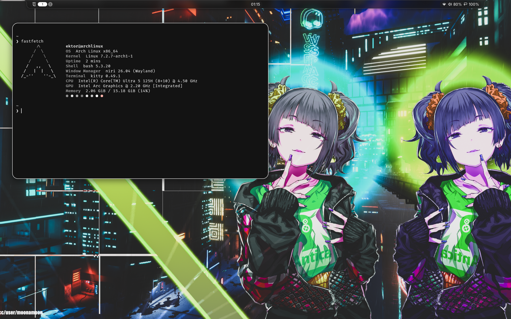

<div align="center">

# dots

Arch · niri · Noctalia

Rounded windows. A quiet bar. One palette across the desktop.

[setup](docs/setup.md) · [keybindings](docs/keybindings.md) · [credits](docs/credits.md)

</div>



My everyday desktop: a scrollable layout, a translucent capsule bar, and
wallpaper-derived monochrome colors shared by Kitty, GTK, niri, and Starship.
The screenshot is from October 3, 2026; the exported config includes the later
bar grouping and GTK adjustments.

### Take what you need

Each module mirrors paths inside your home directory. Browse the files, copy a
snippet, or install only the parts you want. No dotfile manager required.

| Module | Files | What it does |
| :--- | :--- | :--- |
| `niri` | [config](modules/niri/.config/niri/config.kdl) · [binds](modules/niri/.config/niri/noctalia/binds.kdl) · [outputs](modules/niri/.config/niri/noctalia/outputs.kdl) | 10px gaps, 20px corners, quick animations, overview backdrop |
| `noctalia` | [config.toml](modules/noctalia/.config/noctalia/config.toml) | Capsule bar, panels, lock screen, wallpaper palette |
| `kitty` | [kitty.conf](modules/kitty/.config/kitty/kitty.conf) · [palette](modules/kitty/.config/kitty/themes/noctalia.conf) | FiraCode Nerd Font, 10px padding, monochrome colors |
| `gtk` | [GTK 3](modules/gtk/.config/gtk-3.0) · [GTK 4](modules/gtk/.config/gtk-4.0) | Matching application colors, Adwaita icons |
| `qt` | [kdeglobals](modules/qt/.config/kdeglobals) | Color snapshot for apps that read KDE settings |
| `fonts` | [fonts.conf](modules/fonts/.config/fontconfig/fonts.conf) | Inter UI, FiraCode monospace, language-aware CJK fallbacks |
| `bash` | [.bashrc](modules/bash/.bashrc) · [.bash_profile](modules/bash/.bash_profile) | fzf bindings, optional Starship and mise |
| `starship` | [starship.toml](modules/starship/.config/starship.toml) | Default prompt with the shared palette |
| `fastfetch` | [config.jsonc](modules/fastfetch/.config/fastfetch/config.jsonc) | Small Arch logo and a compact system summary |
| `btop` | [btop.conf](modules/btop/.config/btop/btop.conf) | Rounded panels and braille graphs |
| `environment` | [environment](modules/environment/.config/environment.d/10-user.conf) · [service](modules/environment/.config/systemd/user/niri.service.d/10-path.conf) | User binaries and mise shims in the graphical PATH |
| `wallpaper` | [image](modules/wallpaper/Pictures/Wallpapers/neon-exzm3l.png) | The wallpaper shown above; [artwork notice](docs/credits.md) |

```bash
git clone --depth 1 https://github.com/nochinsky/dots.git
cd dots

python install.py --list
python install.py kitty starship            # preview
python install.py kitty starship --apply    # install just these two
```

The installer copies files and backs up conflicts, including symlinks. It
keeps unrelated files, respects `XDG_CONFIG_HOME` and `XDG_STATE_HOME`, and
doesn't install packages or start services. Copies let Noctalia update generated
theme files without changing your Git checkout.

For the whole desktop, follow [setup](docs/setup.md) for packages, monitor
settings, GTK preferences, and existing Noctalia overrides.

### Details

Tested here with **niri 26.04**, **Noctalia 5.2.1**, and **Kitty 0.49.2** on
Arch Linux. These are working configuration snapshots, not a pinned OS image.
Noctalia v4's Quickshell/JSON configuration is a different format.

Colors shipped with individual modules work on their own. When using Noctalia,
its enabled templates regenerate those palettes as the wallpaper changes.
The complete niri config uses Noctalia for its shell shortcuts.

The earlier Hyprland setup remains in [Git history](https://github.com/nochinsky/dots/commit/311ea1a).
Configuration and installer: [MIT](LICENSE). Third-party artwork keeps its own rights.
